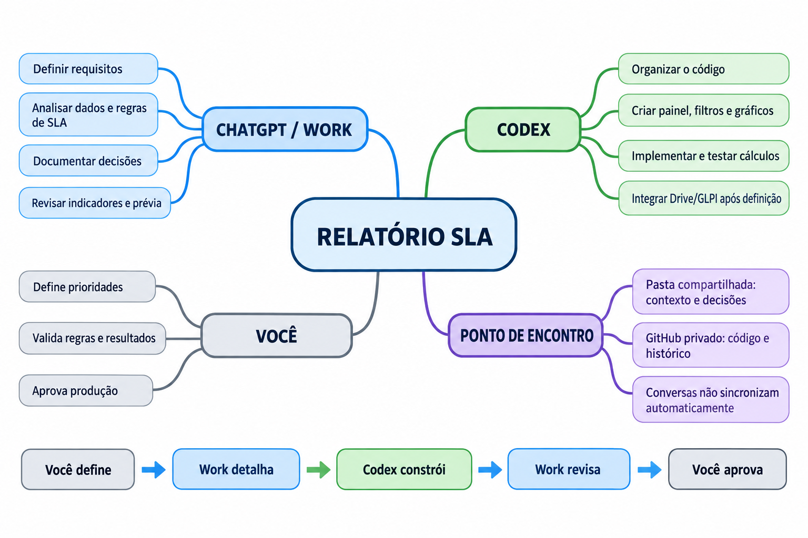
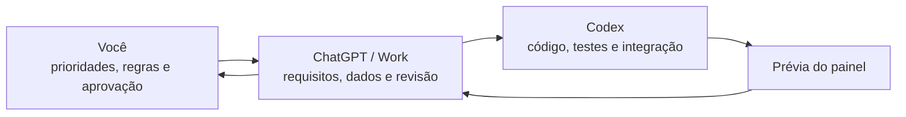

# Relatório SLA

Projeto para acompanhar chamados, prazos e indicadores de atendimento em um painel web.

## Estado atual

O projeto está em planejamento. Este repositório foi criado para reunir o código e a documentação do Relatório SLA. Ainda não há aplicação nem integração com dados reais neste repositório.

## Objetivo

Começar com uma demonstração usando dados fictícios. Depois, conectar a fonte oficial de dados do Google Drive/GLPI, após definir as regras de acesso e tratamento das informações.

## Recursos previstos

- Visão de chamados por status, área, comprador e responsável.
- Indicadores de cumprimento de SLA, primeira resposta e resolução.
- Filtros, busca e evolução dos resultados ao longo do tempo.
- Identificação de chamados fora do prazo ou em risco.

## Como vamos trabalhar

**Você** define prioridades, confirma as regras do negócio, avalia a demonstração e aprova qualquer publicação em produção.

**ChatGPT / Work** organiza os requisitos, analisa os campos e as regras de SLA, documenta decisões e revisa os indicadores e a prévia. Aqui se define o que o painel precisa mostrar e como interpretar os resultados.

**Codex** organiza o projeto, cria o painel, implementa e testa os cálculos, prepara a versão de demonstração e integra Drive/GLPI quando a fonte oficial, as regras e as permissões estiverem definidas.

### Mapa mental do projeto

### Mapa de responsabilidades

| Quem | Faz | Entrega para a próxima etapa |
| --- | --- | --- |
| **Você** | Define prioridades e regras de SLA, valida indicadores e aprova a publicação. | Decisões e aprovação registradas. |
| **ChatGPT / Work** | Organiza requisitos, analisa dados e regras, documenta decisões e revisa os resultados com você. | Critérios de cálculo e pendências claros para o Codex. |
| **Codex** | Organiza o código, constrói o painel, implementa e testa os cálculos e prepara a demonstração. Integra Drive/GLPI depois da definição de fonte, regras e permissões. | Código, testes e prévia para revisão. |

**Fluxo:** Você define → Work detalha e registra → Codex constrói e testa → Work revisa com você → Você aprova. Se houver ajuste, Work esclarece a regra e Codex corrige a implementação.

### Onde registramos o trabalho

- **Pasta compartilhada:** contexto, decisões e arquivos em preparação.
- **Este repositório privado:** documentação, código e histórico de alterações quando os arquivos forem incorporados.
- **Conversas:** as abas ChatGPT / Work e Codex não sincronizam automaticamente suas mensagens. Registre decisões importantes nos arquivos para que ambas possam consultá-las.

O repositório ainda não está conectado à pasta local. A versão anterior do painel e as planilhas citadas no contexto precisam ser localizadas e revisadas antes de qualquer incorporação. O projeto da faculdade `Programacao-oo` é independente.

### Ferramentas e publicação

- **Explorador de arquivos:** guarda os arquivos locais em preparação na pasta compartilhada `Teste`.
- **GitHub:** mantém a documentação, o código e o histórico no repositório privado `relatorio-sla`.
- **Google Drive / GLPI:** são as possíveis fontes dos dados reais, após definir acesso, campos e regras de tratamento.
- **Netlify:** servirá para apresentar prévias e, quando aprovado, hospedar o painel. O projeto original `relatorio-glpi-teste` não deve ser alterado sem autorização. O projeto `relatorio-glpi-completo-2026` foi criado para testes e também não deve ser atualizado sem aprovação explícita.

Fluxo previsto: arquivos e dados de origem → desenvolvimento local → GitHub → prévia no Netlify → sua revisão → aprovação → produção.

## Decisões pendentes

- Tipos de SLA e prazos por área ou prioridade.
- Datas usadas para abertura, primeira resposta e encerramento.
- Horário de trabalho, horas úteis e feriados.
- Fonte oficial dos dados, atualização e permissões dos usuários.
- Indicadores e filtros da primeira versão.

## Dados e segurança

Use apenas dados fictícios ou anonimizados no repositório. Não inclua planilhas operacionais, senhas, tokens ou arquivos de configuração com credenciais. A publicação do painel em produção depende de aprovação do responsável pelo projeto.

## Próximos passos

1. Confirmar as regras de SLA e os campos necessários.
2. Localizar e revisar o código existente antes de incorporá-lo.
3. Criar a versão de demonstração e testar os cálculos.
4. Revisar uma prévia antes de conectar dados reais ou publicar.
